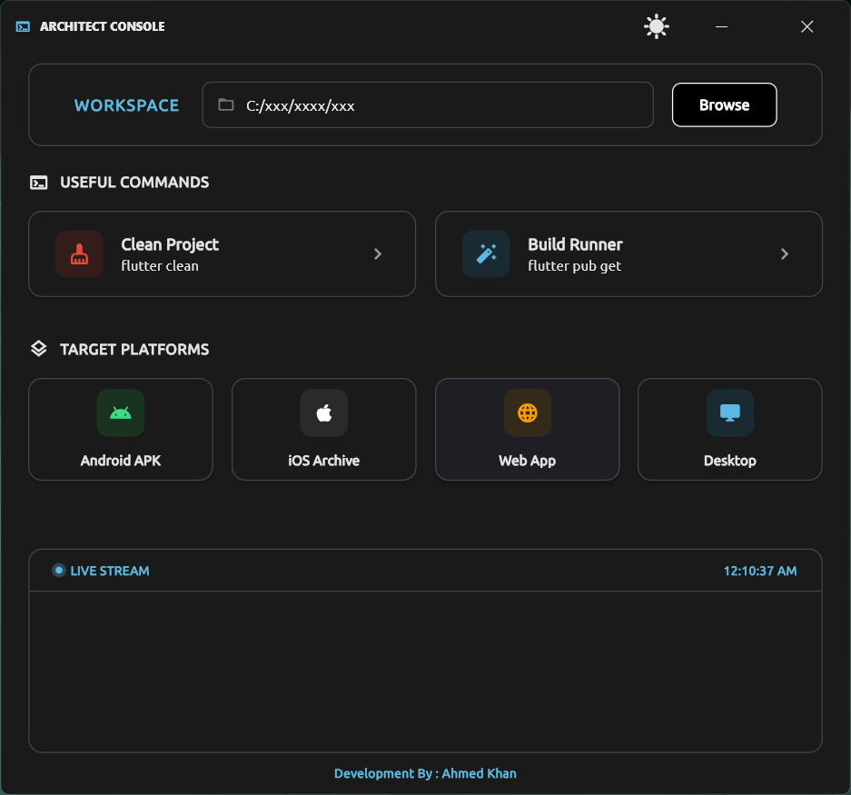
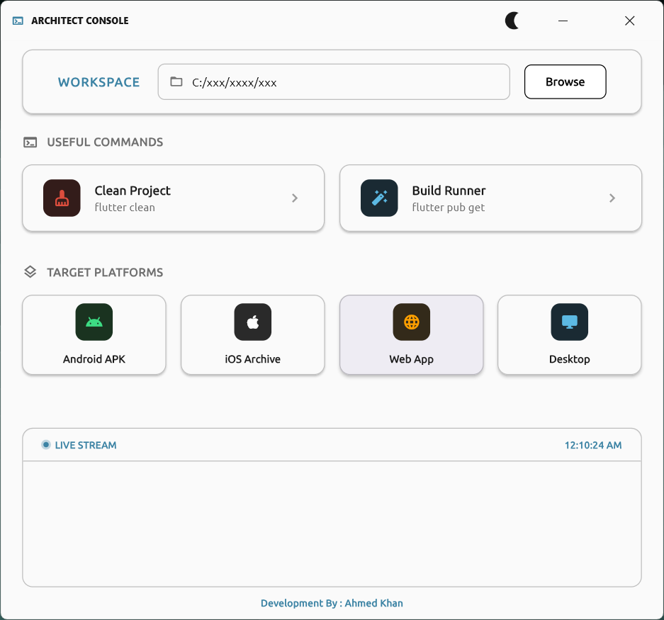

# 🏗️ Architect Console

<p align="center">
  
  
  
  
</p>

<p align="center">
  <strong>A powerful Flutter desktop application for managing and building Flutter projects on Windows</strong>
</p>

---

## 📖 Overview

**Architect Console** is a sleek, modern desktop application designed to streamline Flutter development workflows. It provides a graphical interface to execute common Flutter commands, build applications for multiple platforms, and monitor build outputs in real-time.

### ✨ Key Features

- 📁 **Workspace Management** - Select and manage your Flutter project directory
- 🚀 **One-Click Builds** - Build for Android, iOS, Web, and Desktop platforms
- ⚡ **Quick Commands** - Execute `flutter clean` and `flutter pub get` instantly
- 📺 **Live Console Output** - Real-time build logs with timestamps
- 🌓 **Dark/Light Theme** - Toggle between themes for comfortable coding
- 🖼️ **Custom Window Controls** - Native-looking window buttons
- 🖥️ **Windows Desktop** - Designed specifically for Windows platform

---

## 🖼️ Screenshots

| Dark Mode | Light Mode |
|-----------|------------|
|  |  |

---

## 🚀 Getting Started

### Prerequisites

- [Flutter SDK](https://flutter.dev/docs/get-started/install) (3.9.2 or higher)
- [Dart SDK](https://dart.dev/get-dart) (3.9.2 or higher)
- A supported IDE (VS Code, Android Studio, etc.)

### Installation

1. **Clone the repository**
   ```bash
   git clone https://github.com/your-username/architect_console.git
   cd architect_console
   ```

2. **Install dependencies**
   ```bash
   flutter pub get
   ```

3. **Run the application**
   ```bash
   flutter run -d windows
   ```
   
   > ⚠️ **Note**: This application is currently designed for **Windows only**.

---

## 📦 Dependencies

| Package | Version | Purpose |
|---------|---------|--------|
| [file_picker](https://pub.dev/packages/file_picker) | ^8.0.0 | Directory/folder selection |
| [provider](https://pub.dev/packages/provider) | ^6.1.5 | State management |
| [intl](https://pub.dev/packages/intl) | ^0.20.2 | Date/time formatting |
| [bitsdojo_window](https://pub.dev/packages/bitsdojo_window) | ^0.1.6 | Custom window controls |

---

## 🏗️ Project Structure

```
lib/
├── main.dart                          # App entry point & window config
├── features/
│   ├── home/
│   │   └── presentation/
│   │       └── home_page.dart          # Main home page UI
│   └── run_command.dart               # Command execution logic
└── shared/
    ├── util/
    │   ├── app_color.dart             # Theme-aware color helper
    │   ├── global_provider.dart        # Global state management
    │   ├── growing_dot.dart            # Animated status indicator
    │   ├── real_time_log_timestamp.dart # Live timestamp widget
    │   ├── select_folder.dart          # Folder selection helper
    │   ├── show_confirm_dialog.dart    # Confirmation dialog
    │   └── show_finish_dialog.dart     # Build completion dialog
    └── widgets/
        ├── build_command_card.dart     # Command card widget
        ├── build_platform_card.dart    # Platform card widget
        ├── build_section_title.dart    # Section title widget
        ├── build_workspace_bar.dart    # Workspace bar widget
        └── u_button.dart               # Custom button widget
```

---

## 🎯 Features in Detail

### 📁 Workspace Management
- Select your Flutter project directory with a single click
- Visual path display with folder icon
- Easy directory browsing via system file picker

### ⚡ Quick Commands

| Command | Description |
|---------|-------------|
| `flutter clean` | Removes build artifacts and cached files |
| `flutter pub get` | Fetches project dependencies |

### 🚀 Platform Builds

| Platform | Build Command |
|----------|---------------|
| 🤖 Android APK | `flutter build apk --release` |
| 🍎 iOS Archive | `flutter build ios` |
| 🌐 Web App | `flutter build web` |
| 🖥️ Desktop (Windows) | `flutter build windows` |

> ⚠️ **Note**: The build commands for Android, iOS, and Web can be executed from the console, but the **Architect Console app itself runs only on Windows**.

### 📺 Live Console
- Real-time command output streaming
- Live timestamp updates every second
- Animated status indicator (growing dot)
- Build completion notifications

---

## 🎨 Architecture

This project follows **Feature-First Architecture** with clean separation of concerns:

- **Presentation Layer** - UI widgets and pages
- **Business Logic** - Command execution and state management
- **Shared Components** - Reusable widgets and utilities

### State Management
Uses `Provider` for simple and efficient state management with `ChangeNotifier` pattern.

---

## 🛠️ Build & Release

### Build for Production

```bash
# Windows
flutter build windows --release
```

The built application will be available in `build/windows/runner/Release/`.

---

## 🤝 Contributing

Contributions are welcome! Please feel free to submit a Pull Request.

1. Fork the repository
2. Create your feature branch (`git checkout -b feature/AmazingFeature`)
3. Commit your changes (`git commit -m 'Add some AmazingFeature'`)
4. Push to the branch (`git push origin feature/AmazingFeature`)
5. Open a Pull Request

---

## 📝 Code Style

This project follows effective Dart guidelines:
- `snake_case` for file names
- `camelCase` for variables and functions
- `PascalCase` for classes and widgets
- Proper documentation comments with `///`

---

## 📄 License

This project is licensed under the MIT License - see the [LICENSE](LICENSE) file for details.

---

## 👨‍💻 Author

**Ahmed Khan**

---

## 🙏 Acknowledgments

- [Flutter](https://flutter.dev/) - UI toolkit for building natively compiled applications
- [Provider](https://pub.dev/packages/provider) - State management solution
- [BitsDojo Window](https://pub.dev/packages/bitsdojo_window) - Custom window controls

---

<p align="center">
  Made with ❤️ using Flutter
</p>
